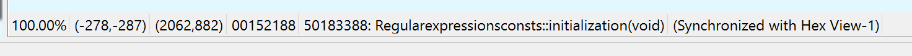

# IDA skin: default-hd

## 1. Why do I create this theme?

We know that some fonts are badly displayed on Windows 10 when it comes to high DPI. 

For example, the font `Courier New`, on my laptop Surface Book 2, is displayed like this:

which I feel is quiet too thin and doesn't have a enough contrast.

So I changed it to `Segoe UI` with font size `9pt`:

Well, I think it looks more comfortable.

## 2. Usage

Copy `default-hd` directory to `<IDA install path>\themes`.

Then start/restart IDA -> Options -> Color -> select `default-hd` theme

